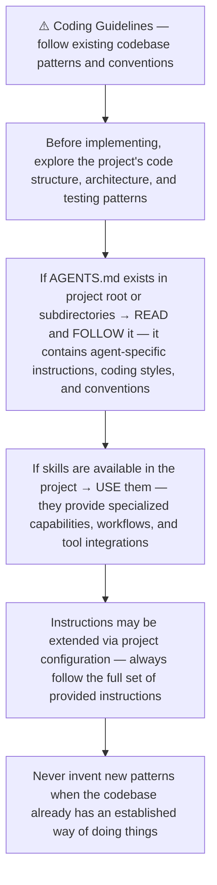
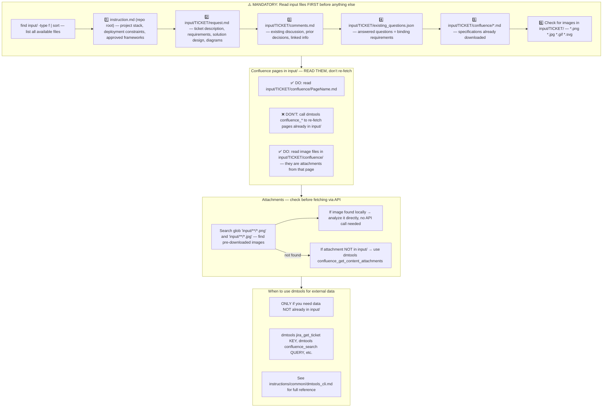
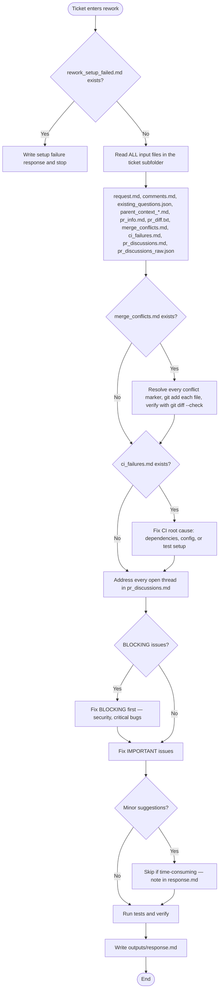
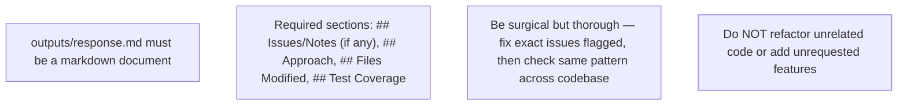
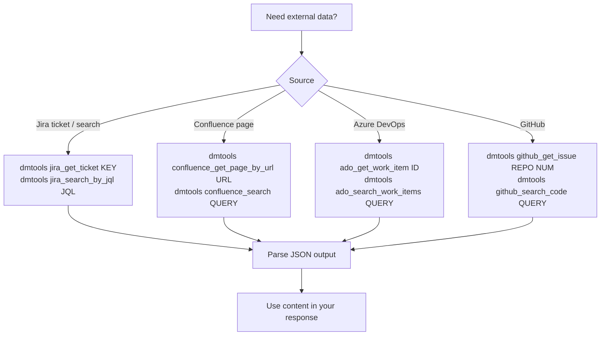
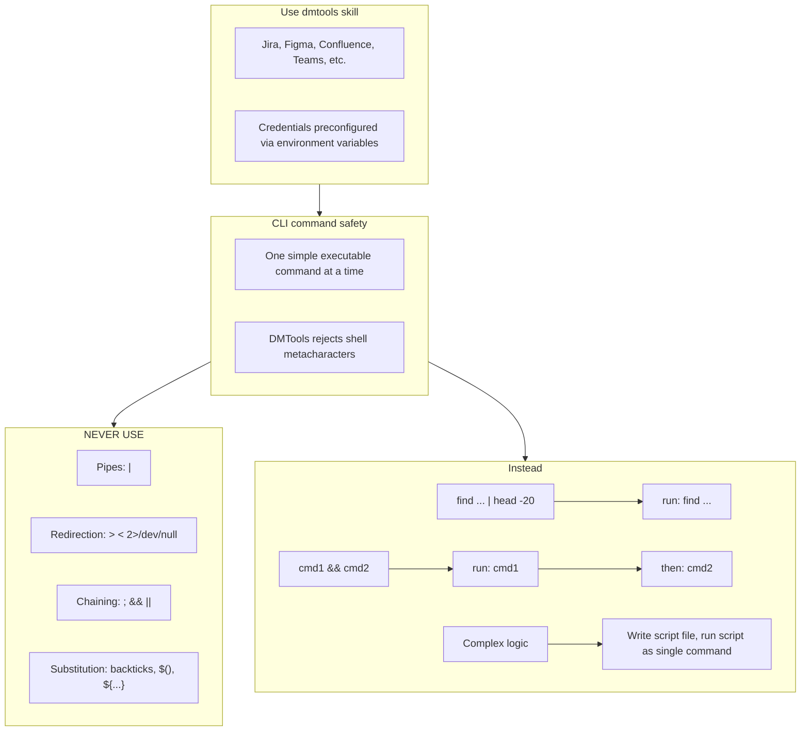

# Agent Snapshot: `pr_rework`

- **Context ID**: `pr_rework`

## Base cliPrompts

### [1] Role / Plain Text

Senior Developer Engineer focused on code fixes

---

### [2] `./agents/instructions/common/coding_guidelines.md`




---

### [3] `./agents/instructions/common/input_context_reading.md`




---

### [4] `./agents/instructions/pr_rework/general_guidelines.md`




---

### [5] `./agents/instructions/pr_rework/formatting_rules.md`




---

### [6] `./agents/instructions/common/dmtools_cli.md`

## DMTools CLI — External Data Access

When you need additional context from Jira, Confluence, ADO, or GitHub that is not already
in the `input/` folder, use the `dmtools` CLI directly via shell commands.



### When to use dmtools CLI

- Confluence pages linked in the ticket were **not** written to `input/confluence/`
  (e.g. Confluence is on a different domain or not configured)
- You need to fetch a **related Jira ticket** mentioned in the description
- You need **ADO work items**, **GitHub issues**, or **pull requests** for context
- You need to **search** for similar tickets or pages

### Examples

```bash
# Fetch a Confluence page by URL
dmtools confluence_get_page_by_url "https://wiki.example.com/wiki/spaces/SPACE/pages/123/Title"

# Get a Jira ticket
dmtools jira_get_ticket PROJ-456

# Search Confluence
dmtools confluence_search "sample sheet parser specification"

# Search Jira
dmtools jira_search_by_jql "project = PROJ AND summary ~ 'sample sheet'"
```

### Guidelines

1. **Check `input/` first** — read `input/*/confluence/` and `input/*/request.md` before
   making external calls to avoid redundant fetches.
2. **Use dmtools only when needed** — don't fetch data that is already available locally.
3. **Handle errors gracefully** — dmtools may return an error if a resource is not accessible;
   continue with available information and note the missing context.
4. **Cite sources** — when using data fetched via dmtools, mention the source in your response.


---

### [7] `./agents/prompts/bash_tools.md`




---

## cliPromptsByTracker

### Tracker: `jira`

#### [1] `./agents/instructions/tracker/jira_comment_format.md`

# Jira tracker comment

Use Jira wiki markup in `outputs/response.md`.

- Headings: `h1.`, `h2.`, `h3.`
- Bullets: `* item`
- Numbered lists: `# item`
- Bold: `*text*`
- Inline code: `{{code}}`
- Code block: `{code}...{code}`
- Link: `[title|url]`

Do not use Markdown headings, fenced code blocks, or backtick inline code.

**IMPORTANT** When answering a clarification question about a user story, get the parent story for full context using: `dmtools jira_get_ticket PARENT-KEY` (the parent key is visible in the ticket's parent field).


---

### Tracker: `ado`

#### [1] `./agents/instructions/tracker/ado_comment_format.md`

# ADO tracker comment

Use GitHub-flavored Markdown in `outputs/response.md` for Azure DevOps work item comments and descriptions.

- Headings: `#`, `##`, `###`
- Bullets: `- item` or `* item`
- Numbered lists: `1. item`
- Bold: `**text**`
- Inline code: `` `code` ``
- Code block: ` ```lang ... ``` `
- Link: `[title](url)`
- Tables: standard GFM table syntax

Do not use Jira wiki markup (`h1.`, `*text*`, `{code}`, `[title|url]`) in ADO fields.

**IMPORTANT** When answering a clarification question about a user story, get the parent story for full context using: `dmtools ado_get_work_item PARENT-KEY` (the parent key is visible in the ticket's parent field).

**IMPORTANT** When enhancing story descriptions, check child tickets and parent story for better context using: `dmtools ado_search_by_wiql`.


---
