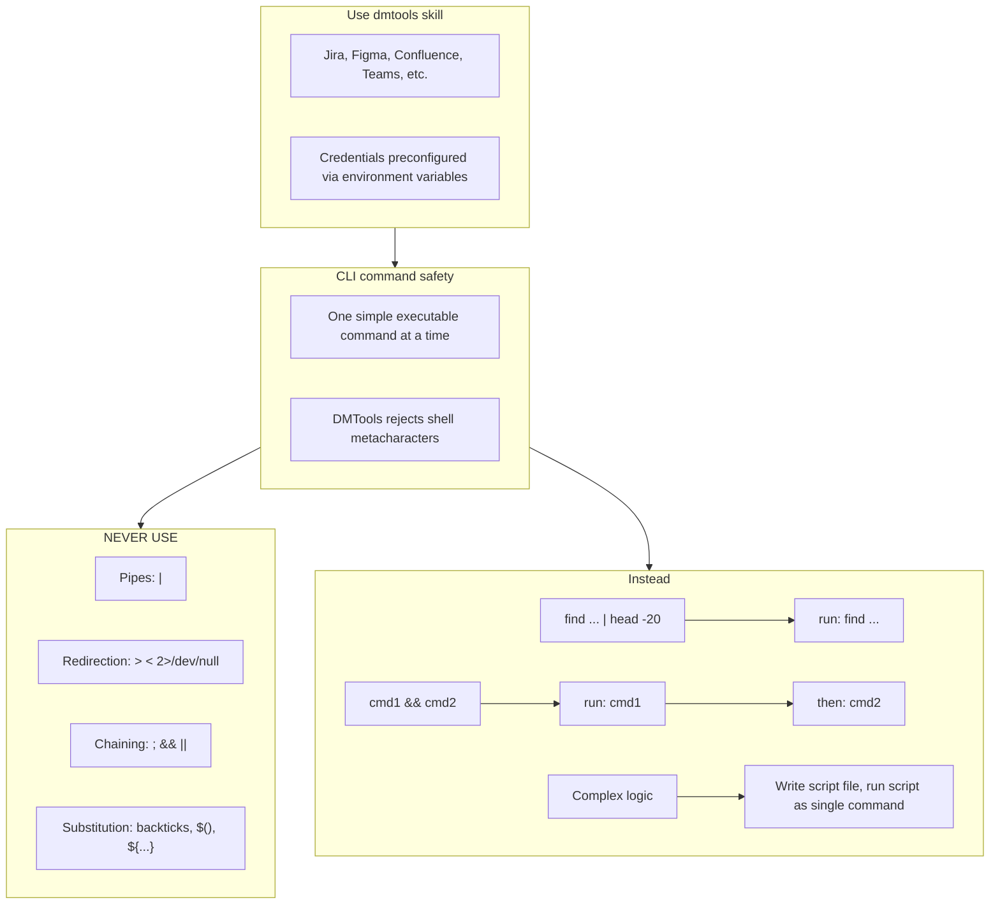
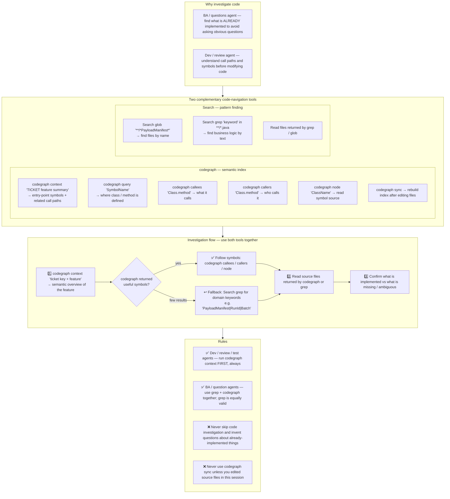

# Agent Snapshot: `pr_test_automation_rework`

- **Context ID**: `pr_test_automation_rework`

## Base cliPrompts

### [1] `./agents/prompts/bash_tools.md`




---

### [2] `./agents/prompts/codegraph_tools.md`




---

## Legacy cliPrompt (scalar)

### `./agents/prompts/pr_test_automation_rework_prompt.md`

User request is in the 'input' folder. Read all files there.

Before modifying or reviewing any source/test code, run CodeGraph once to orient
yourself in the repository. Use a command such as:

```bash
codegraph context "test automation rework architecture and relevant testing patterns"
```

Reading files from `input/` is allowed first because they are generated task
context, but your first repository code-navigation command must be CodeGraph.
Do not finish rework without a recorded CodeGraph invocation.

**IMPORTANT**: Read in order:
1. `request.md` *(if present)* — full ticket details
2. `comments.md` *(if present)* — ticket comment history; recent comments contain previous test run results and review feedback
3. `linked_bugs.md` *(if present)* — **CRITICAL**: linked bugs that block or relate to this test case.
   - Read the **Solution** field and **AI Fix Comments** carefully — they describe HOW the bug was fixed.
   - If the fix introduced **timing or async behavior** (e.g., a heartbeat probe with an interval, retry delay, polling timeout) — the test **MUST** wait long enough to observe the effect. Do NOT assert immediately after triggering the action.
   - Example: if the bug was fixed by a heartbeat probe that runs every 5 seconds, the test must wait at least 5–10 seconds after simulating the failure condition before asserting the error appears.
4. `ticket.md` — the Test Case ticket (objective, steps, expected result)
5. `pr_info.md` — PR metadata
6. `pr_diff.txt` — current test code
7. `merge_conflicts.md` *(if present)* — **Resolve all merge conflicts FIRST** before touching anything else
8. `pr_discussions.md` — review comments that must be addressed
9. `pr_discussions_raw.json` — structured thread data with IDs for replies

**If `merge_conflicts.md` is present**: Resolve every `<<<<<<<` / `=======` / `>>>>>>>` conflict marker in the listed files, then `git add <file>` for each. Do NOT `git commit` or `git merge --abort`.

The feature code is **already in main branch**. Your job is to:
1. Fix all issues raised in the PR review comments (address every thread)
2. Re-run the test and capture the new result
3. Write output files

**You may ONLY write code inside the `testing/` folder.**

## Product defects discovered during rework

If a reviewer asks for behavior that cannot be implemented from `testing/` because the production code, public API, repository service, CLI command, schema, or workflow does not expose the required capability, do **not** create a synthetic passing fixture and do **not** modify code outside `testing/`.

Instead, keep or adjust the test so it exercises the closest production-visible action allowed by the Test Case, let it fail for the real product gap, and write `outputs/test_automation_result.json` with `"status": "failed"`. Also write `outputs/bug_description.md` with enough detail for the downstream bug creation flow to create or link a Bug: reproduction steps, expected result, actual result, exact missing/broken production capability, and the failing command/output.

This is not `blocked_by_human`: missing product behavior is a failed test/product bug. The correct workflow is failed Test Case -> bug creation, not fake green test code.

## Output files

**⚠️ CRITICAL: All output files MUST be written to `outputs/` at the repository root** (e.g. `/home/runner/work/repo/repo/outputs/`).
Do NOT write them inside `input/`, `input/TICKET-KEY/`, or any subfolder of `input/`. The post-processing script reads from `outputs/` at the repo root — writing elsewhere means all results will be silently lost.

Run `mkdir -p outputs` first to ensure the directory exists.

- `outputs/response.md` — tracker-formatted rework summary (short, factual): what was fixed + new test result
- `outputs/pr_body.md` — SCM-formatted PR/comment body (always required)
- `outputs/test_automation_result.json` — **MANDATORY — always write this file**, even if the test failed or errored. Use exactly this format:
  ```json
  { "status": "passed", "passed": 1, "failed": 0, "skipped": 0, "summary": "1 passed, 0 failed" }
  ```
  or for failure:
  ```json
  { "status": "failed", "passed": 0, "failed": 1, "skipped": 0, "summary": "0 passed, 1 failed", "error": "AssertionError: <exact error message>" }
  ```
  The `"status"` field **must** be exactly `"passed"` or `"failed"` (lowercase). Missing or wrong field name causes the pipeline to break.
- `outputs/review_replies.json` — replies per thread: `{ "replies": [{ "inReplyToId": 123, "threadId": "PRRT_...", "reply": "Fixed: ..." }] }`
- `outputs/bug_description.md` — updated tracker-formatted bug description (only if test still FAILED)


---

## Legacy agentParams

```json
{
  "aiRole": "Senior QA Automation Engineer focused on test code fixes",
  "instructions": [
    "./agents/instructions/test_automation/test_automation_architecture.md",
    "./agents/instructions/test_automation/test_automation_instructions.md",
    "./agents/instructions/test_automation/test_automation_json_output.md",
    "./agents/instructions/rework/rework_instructions.md"
  ],
  "knownInfo": "",
  "formattingRules": "./agents/instructions/development/formatting_rules.md"
}
```

---
